# Phân Tích & Theo Dõi Bóng Đá Bằng AI

Dự án thị giác máy tính ứng dụng AI để theo dõi và phân tích các trận đấu bóng đá. Hệ thống phát hiện cầu thủ, trọng tài, quả bóng; chiếu tọa độ lên bản đồ chiến thuật 2D (minimap); tính toán tốc độ, quãng đường di chuyển, tỉ lệ kiểm soát bóng, và phát hiện đội hình chiến thuật.

Kiến trúc pipeline gồm 2 pha:

- **Pha 1 - Tracking**: Phát hiện (YOLOv8) + theo dõi (ByteTrack) + nội suy + ước lượng camera + homography + tính tốc độ + gán đội + gán bóng
- **Pha 2 - Rendering**: Phát hiện đội hình + vẽ annotation + minimap + heatmap + xuất video

## Tính Năng Chính

- **Phát hiện & Theo dõi**: YOLOv8x + ByteTrack cho cầu thủ, trọng tài, bóng. Nội suy tuyến tính Pandas cho frame bị mất tracking.
- **Phát hiện keypoint sân**: 32 điểm mốc sân bóng (góc sân, vòng cấm, chấm phạt đền...) dùng cho homography.
- **Chiếu tọa độ 2D**: Perspective transform qua cv2.findHomography -> tọa độ sân thực tế (cm).
- **Ước lượng camera**: Lucas-Kanade Optical Flow, chỉ track feature biên trái/phải để tính (dx, dy).
- **Tính tốc độ & quãng đường**: Tốc độ thật (km/h, giới hạn 38km/h) và quãng đường tích lũy (m) theo cửa sổ 5 frame.
- **Gán đội**: K-Means clustering trên màu áo (vùng jersey phía trên).
- **Kiểm soát bóng**: Gán bóng cho cầu thủ gần nhất (<= 70px), tính tỉ lệ % theo thời gian thực.
- **Phát hiện đội hình**: K-Means nhiều tuyến (3 hoặc 4 cụm) -> bỏ phiếu xác định sơ đồ (4-3-3, 4-4-2...).
- **Minimap**: Bản đồ tactical 2D (350x230) overlay góc dưới phải.
- **Heatmap**: Ảnh nhiệt mật độ di chuyển (630x420) cho từng đội và tổng hợp.
- **Web UI (Gradio/Streamlit)**: Upload video, xem kết quả, log thời gian thực.

<p align="center">
  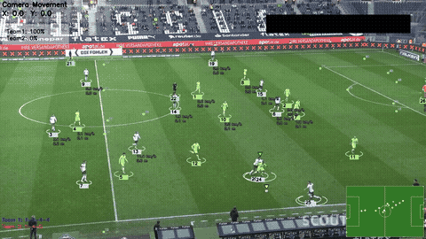
</p>

## Cấu Trúc Dự Án

```
football_tracking/
├── main.py                          # Pipeline chính (entry point)
├── requirements.txt                 # Dependencies
├── .gitignore                       # Git ignore rules
│
├── trackers/
│   └── tracker.py                   # YOLO detection + ByteTrack + interpolation + drawing
│
├── estimators/
│   ├── camera_movement_estimator.py # Optical flow -> camera pan
│   ├── view_transformer.py          # Homography -> tọa độ sân thực
│   └── speed_distance_estimator.py  # Tốc độ & quãng đường
│
├── asigners/
│   ├── team_assigner.py             # K-Means phân cụm màu áo
│   └── player_ball_assigner.py      # Gán bóng cho cầu thủ gần nhất
│
├── pitch_keypoint_detector/
│   └── pitch_keypoint_detector.py   # YOLO-pose keypoint + SoccerPitchConfig
│
├── minimap/
│   └── minimap_renderer.py          # Vẽ tactical 2D minimap
│
├── heatmap_generator/
│   └── heatmap_generator.py         # Tạo ảnh nhiệt mật độ
│
├── formations/
│   └── formation_analyzer.py        # Phát hiện đội hình (K-Means)
│
├── app/
│   ├── gradio_app.py                # Giao diện Gradio
│   └── streamlit_app.py             # Giao diện Streamlit
│
├── utils/
│   ├── video_util.py                # Đọc/ghi video (ffmpeg H.264, fallback OpenCV)
│   └── bbox_util.py                 # Hàm tiện ích bounding box
│
├── cleanings/
│   ├── player_cleaning.py           # Làm sạch dataset phát hiện cầu thủ
│   └── pitch_keypoint_cleaning.py   # Làm sạch dataset keypoint sân
│
├── trainings/
│   ├── football_training.py         # Huấn luyện YOLOv8 phát hiện cầu thủ
│   ├── pitch_keypoint_training.py   # Huấn luyện YOLOv8-pose keypoint sân
│   ├── player_dataset.py            # Download dataset từ Roboflow
│   └── pitch_keypoint_dataset.py    # Download dataset từ Roboflow
│
├── analysis/                        # Scripts phân tích & trực quan hóa
│   ├── eda_dataset.py               # EDA tổng quan dataset
│   ├── class_imbalance_analysis.py  # Phân tích mất cân bằng class
│   ├── check_dataset_quality.py     # Kiểm tra chất lượng dataset
│   ├── verify_data_split.py         # Xác minh phân chia train/val/test
│   ├── visualize_label_format.py    # Giải thích YOLO format
│   ├── visualize_preprocessing.py   # Minh họa augmentation
│   ├── visualize_mosaic_augmentation.py # Mosaic augmentation
│   ├── visualize_perspective.py     # Minh họa perspective transform
│   ├── visualize_optical_flow.py    # Minh họa optical flow
│   ├── visualize_ball_interpolation.py # Minh họa nội suy bóng
│   ├── visualize_team_assignment.py # Minh họa K-Means gán đội
│   ├── visualize_player_stats.py    # Thống kê tốc độ/quãng đường
│   ├── visualize_training_results.py# Biểu đồ huấn luyện
│   ├── capture_result_frame.py      # Chụp frame từ video kết quả
│   ├── figures/                     # 15 file PNG ảnh kết quả
│   └── reports/                     # Báo cáo dạng text (.txt)
│
├── models/                          # Model weights (git-ignored)
│   ├── player_detector.pt           # YOLOv8x — phát hiện cầu thủ
│   └── pitch_keypoint_detector.pt   # YOLOv8x-pose — keypoint sân
│
├── input_videos/                    # Video đầu vào (git-ignored, giữ folder)
├── output_videos/                   # Video đầu ra + heatmap (git-ignored)
├── stubs/                           # File pickle cache (git-ignored)
└── cache_gradio/                    # Gradio cache (git-ignored)
```

## Cài Đặt

### Yêu cầu

- Python >= 3.9 (khuyến nghị 3.10 hoặc 3.11)
- GPU NVIDIA CUDA-compatible (>= 4GB VRAM khuyến nghị)
- Hệ điều hành: Windows 10+, Ubuntu 20.04+, Kaggle/Colab

### Các bước

```bash
# Clone repo
git clone <your-repo-url>
cd football_tracking

# Tạo môi trường ảo
python -m venv .venv
.venv\Scripts\activate     # Windows
source .venv/bin/activate  # Linux

# Cài dependencies
pip install -r requirements.txt

# Cài PyTorch riêng theo CUDA version
pip install torch torchvision --index-url https://download.pytorch.org/whl/cu118
```

### Download Models

Đặt các file model vào `models/`:

| File | Nguồn |
|------|-------|
| `models/player_detector.pt` | Train từ `trainings/football_training.py` hoặc download |
| `models/pitch_keypoint_detector.pt` | Train từ `trainings/pitch_keypoint_training.py` hoặc download |

## Cách Sử Dụng

### Pipeline chính

```bash
# Chạy toàn bộ (tracking + render)
python main.py --mode all --video input_videos/sample.mp4

# Chỉ tracking (lưu stub)
python main.py --mode tracking --video input_videos/sample.mp4

# Chỉ render từ stub đã có
python main.py --mode render --video input_videos/sample.mp4
```

### Web UI

```bash
# Giao diện Gradio
python app/gradio_app.py

# Giao diện Streamlit
streamlit run app/streamlit_app.py
```

Trên Kaggle/Colab: thêm `demo.launch(share=True)` để tạo link public.

### Huấn luyện model

```bash
# Download dataset
python trainings/player_dataset.py
python trainings/pitch_keypoint_dataset.py

# Làm sạch dataset
python cleanings/player_cleaning.py
python cleanings/pitch_keypoint_cleaning.py

# Train
python trainings/football_training.py
python trainings/pitch_keypoint_training.py
```

### Phân tích & Trực quan

```bash
# Dataset EDA
python analysis/eda_dataset.py
python analysis/class_imbalance_analysis.py
python analysis/check_dataset_quality.py
python analysis/verify_data_split.py

# Pipeline visualization
python analysis/visualize_perspective.py
python analysis/visualize_optical_flow.py
python analysis/visualize_ball_interpolation.py
python analysis/visualize_team_assignment.py

# Thống kê kết quả
python analysis/visualize_player_stats.py
python analysis/capture_result_frame.py
```

## Đầu Ra

| Kiểu | Định dạng | Vị trí |
|------|-----------|--------|
| Video annotation | .mp4 (H.264), fallback .avi (MJPG) | `output_videos/output_enhanced.mp4` |
| Heatmap | .png (630x420, 3 ảnh) | `output_videos/` |
| Stubs (cache) | .pkl, .npy | `stubs/` |
| Biểu đồ phân tích | .png (15 file) | `analysis/figures/` |
| Báo cáo dataset | .txt | `analysis/reports/` |
| Model weights | .pt | `models/` |

## Thông Số Kỹ Thuật

| Tham số | Giá trị |
|---------|---------|
| YOLO confidence threshold | 0.1 |
| ByteTrack activation threshold | 0.25 |
| ByteTrack lost buffer | 30 frames |
| ByteTrack matching threshold | 0.8 |
| Frame rate tracking | 25 |
| Camera movement threshold | 5 px |
| Homography RANSAC threshold | 5.0 |
| EMA smooth alpha | 0.15 |
| Speed window | 5 frames |
| Max speed cap | 38 km/h |
| Ball assigner distance | 70 px |
| Pitch keypoints | 32 |
| Sân bóng | 120m x 70m |
| Heatmap size | 630 x 420 px |
| Minimap size | 350 x 230 px |

## Kết Quả Demo

### Video đầu ra

Sau khi chạy pipeline, video kết quả với đầy đủ annotation được lưu tại `output_videos/output-5.mp4`:

<p align="center">
  
</p>

*Video demo gồm: ellipse cầu thủ (màu theo đội) + ID, triangle bóng, camera movement overlay, speed/distance text, tỉ lệ kiểm soát bóng, đội hình chiến thuật, minimap tactical 2D.*

### Ảnh kết quả

Các ảnh chụp từ video và biểu đồ phân tích được lưu trong `analysis/figures/`:

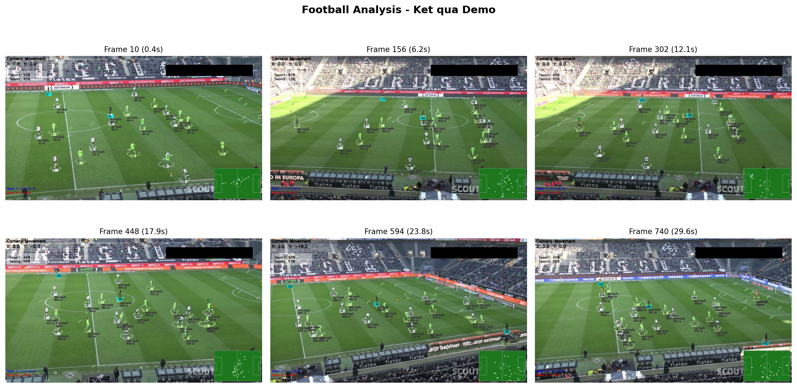
*6 frame kết quả cách đều nhau, hiển thị các lớp annotation trên sân.*

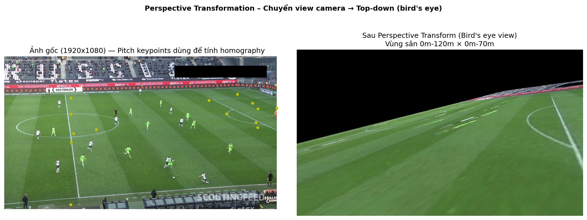
*Phép biến đổi phối cảnh từ góc camera sang góc nhìn bird's eye.*

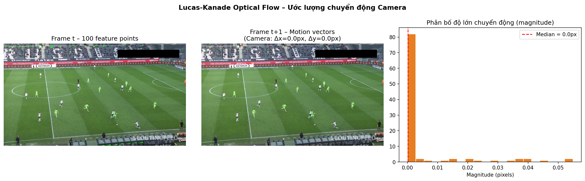
*Ước lượng chuyển động camera bằng Lucas-Kanade Optical Flow.*

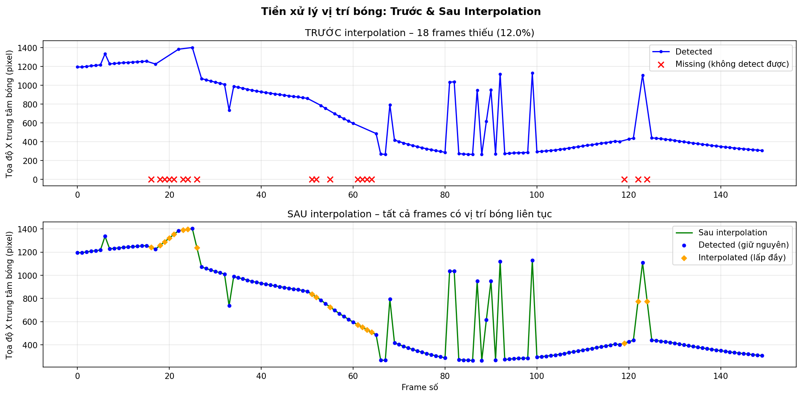
*Nội suy vị trí bóng bằng Pandas — trước và sau interpolation.*

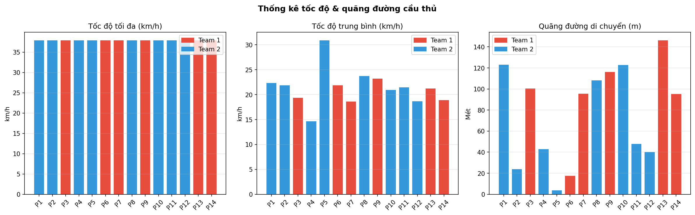
*Thống kê tốc độ tối đa, tốc độ trung bình và quãng đường di chuyển của cầu thủ.*

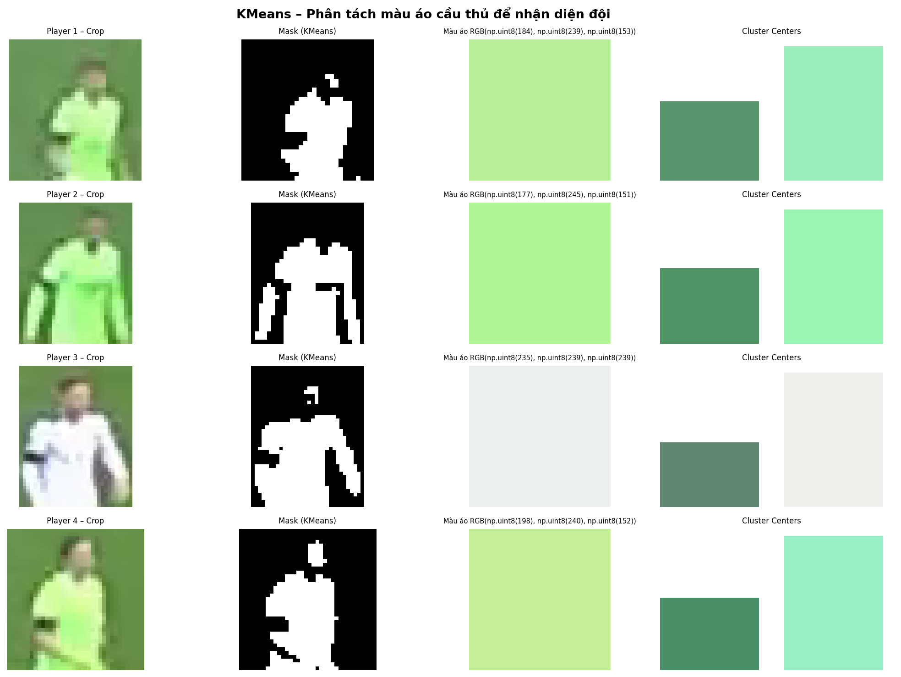
*Phân tách màu áo cầu thủ bằng K-Means clustering để gán đội.*

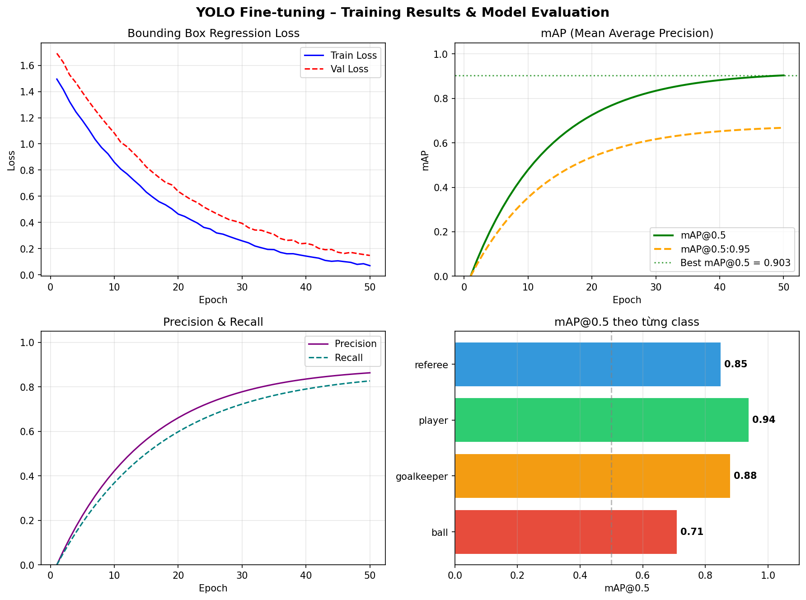
*Biểu đồ huấn luyện: loss, mAP, precision, recall.*

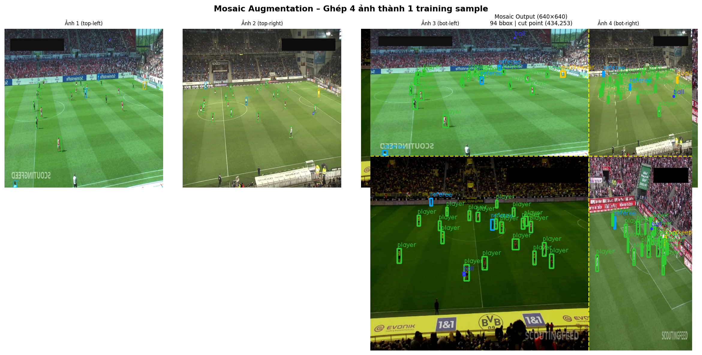
*Kỹ thuật Mosaic Augmentation: ghép 4 ảnh thành 1 training sample.*

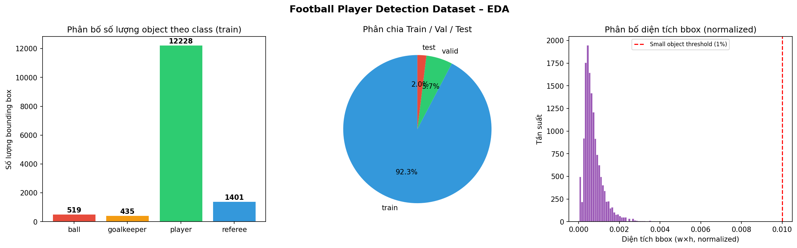
*EDA tổng quan dataset: phân bố class, split distribution, kích thước bbox.*

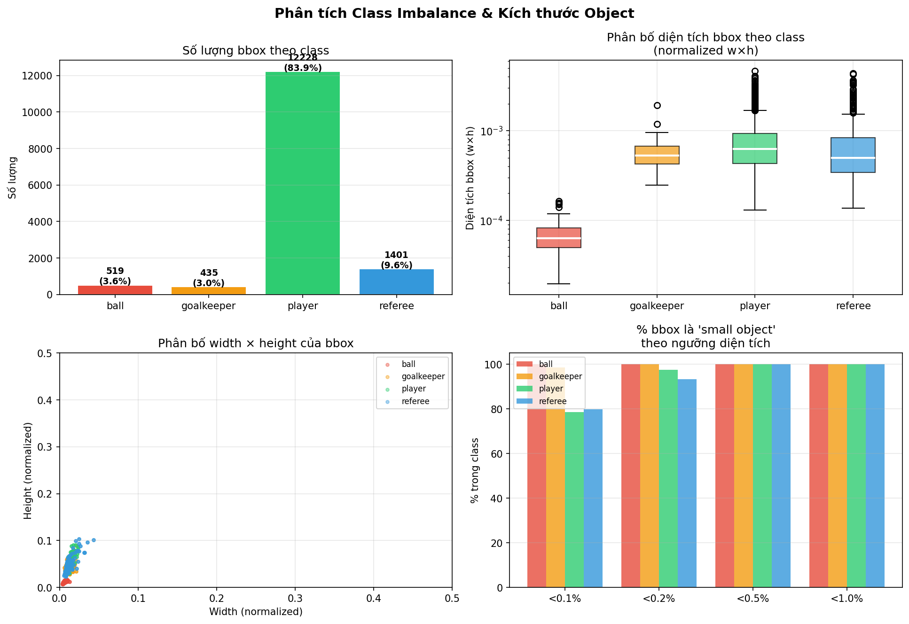
*Phân tích mất cân bằng dữ liệu giữa các class.*

## Lưu Ý

- Cache stub dùng MD5 hash nội dung file để tránh xử lý lại khi upload file trùng qua Gradio
- Video codec mặc định là ffmpeg H.264 (.mp4); nếu không có ffmpeg sẽ fallback về OpenCV (.avi)
- Dataset cleaning loại bỏ ảnh có < 4 keypoint visible (tối thiểu cho homography)
- Kích thước ảnh train: 1280px cho player detection, 640px cho pitch keypoint
- Gộp class "goalkeeper" thành "player" trong pipeline để đơn giản
- Tất cả thư mục `input_videos/`, `output_videos/`, `stubs/`, `models/`, `cache_gradio/`, `datasets/`, `runs/` được git-ignore

## Tài Liệu Tham Khảo

Xem thêm `docs/technical-specification.md` để biết chi tiết về từng module, thuật toán, sơ đồ luồng dữ liệu, và hướng dẫn cài đặt đầy đủ.
