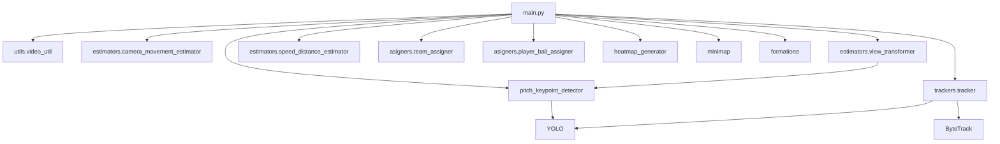

# Đặc tả và Giải thích File main.py

## 1. Tổng quan

`main.py` là file điều phối trung tâm (orchestrator) của toàn bộ hệ thống phân tích bóng đá. File này chịu trách nhiệm điều khiển luồng xử lý từ đầu đến cuối, bao gồm hai pha chính: **Tracking** (pha 1 — phát hiện, theo dõi và tính toán chỉ số) và **Rendering** (pha 2 — kết xuất video, minimap và heatmap). File được thiết kế để chạy trên môi trường Kaggle với đường dẫn chuẩn `/kaggle/input/datasets/huysun`.

---

## 2. Import và Cấu hình (dòng 1–24)

### 2.1. Import thư viện (dòng 1–16)

| Dòng | Câu lệnh | Giải thích |
|------|----------|------------|
| 1 | `import os` | Thư viện tương tác hệ điều hành: tạo thư mục, kiểm tra đường dẫn, xóa file. |
| 2 | `import cv2` | OpenCV: đọc/ghi video, vẽ hình khối (rectangle, ellipse, text), xử lý ảnh. |
| 3 | `import numpy as np` | NumPy: xử lý mảng, tính toán tổng tích lũy (ball control), lưu file .npy. |
| 4 | `import pickle` | Pickle: serialize/deserialize dữ liệu tracking (tracks, camera movement) thành file .pkl. |
| 5 | `import argparse` | argparse: phân tích tham số dòng lệnh (--mode, --video) khi chạy script. |
| 7 | `from utils import read_video, get_foot_position` | Hàm đọc video thành list frame (dòng 1–15 `video_util.py`) và lấy tọa độ chân từ bounding box (dòng 9–10 `bbox_util.py`). |
| 8 | `from trackers import Tracker` | Class Tracker: wrapper YOLOv8 + ByteTrack, phát hiện và theo dõi đối tượng qua các frame. |
| 9 | `from asigners import TeamAssigner, PlayerBallAssigner` | TeamAssigner: K-Means clustering gán màu áo thành đội. PlayerBallAssigner: tính khoảng cách bóng–cầu thủ để gán quyền kiểm soát. |
| 10–12 | `from estimators import (CameraMovementEstimator, ViewTransformer, SpeedDistanceEstimator)` | CameraMovementEstimator (dòng 1–99): Lucas-Kanade optical flow. ViewTransformer (dòng 1–75): homography + perspective transform. SpeedDistanceEstimator (dòng 1–104): speed/distance từ tọa độ thực tế. |
| 13 | `from pitch_keypoint_detector... import PitchKeypointDetector` | Phát hiện 32 keypoint sân bằng YOLOv8x-pose, tính ma trận homography. |
| 14 | `from heatmap_generator... import HeatmapGenerator` | Accumulate vị trí cầu thủ → Gaussian blur → heatmap với OpenCV colormap. |
| 15 | `from minimap... import MinimapRenderer` | Render sân bóng góc nhìn từ trên xuống (350×230 px) với player, ball, referee. |
| 16 | `from formations import detect_team_formation` | Hàm phát hiện đội hình chiến thuật (4-4-2, 4-3-3, ...) bằng K-Means clustering trên tọa độ 10 cầu thủ. |

### 2.2. Hằng số đường dẫn (dòng 18–24)

| Dòng | Câu lệnh | Giải thích |
|------|----------|------------|
| 19 | `KAGGLE_DATASET_DIR = '/kaggle/input/datasets/huysun'` | Đường dẫn gốc chứa dataset và model trên Kaggle. Đây là thư mục input do người dùng upload lên Kaggle Dataset. |
| 20 | `PLAYER_MODEL_PATH = os.path.join(KAGGLE_DATASET_DIR, 'models/player_detector.pt')` | Đường dẫn tuyệt đối đến file weights của YOLOv8x phát hiện cầu thủ. |
| 21 | `PITCH_KP_MODEL_PATH = os.path.join(KAGGLE_DATASET_DIR, 'models/pitch_keypoint_detector.pt')` | Đường dẫn tuyệt đối đến file weights của YOLOv8x-pose phát hiện keypoint sân. |
| 22 | `DEFAULT_VIDEO_PATH = os.path.join(KAGGLE_DATASET_DIR, 'input-videos/sample.mp4')` | Đường dẫn video mẫu mặc định khi người dùng không chỉ định --video. |
| 24 | `STUB_DIR = 'stubs'` | Thư mục lưu cache (pickle + numpy) tại `/kaggle/working/football_tracking/stubs`. Dùng `os.makedirs` ở dòng 88 để tạo nếu chưa tồn tại. |

---

## 3. Pha 1 — Tracking (dòng 27–96)

### 3.1. Định nghĩa hàm (dòng 27)

```python
def phase1_tracking(video_path=DEFAULT_VIDEO_PATH):
```

Hàm thực hiện toàn bộ pha tracking, nhận đầu vào là đường dẫn video, trả về 5 giá trị: `video_frames, tracks, cam_move, team_ball_control, team_assigner`.

### 3.2. Đọc video (dòng 28–32)

| Dòng | Câu lệnh | Giải thích |
|------|----------|------------|
| 28 | `video_frames = read_video(video_path)` | Gọi `utils.video_util.read_video()` — dùng `cv2.VideoCapture` đọc từng frame, trả về list NumPy array (H×W×3). |
| 29 | `print(...)` | In số frame đã đọc và đường dẫn file. |
| 30 | `cap = cv2.VideoCapture(video_path)` | Mở lại video để lấy FPS. `cv2.CAP_PROP_FPS` trả về số frame/giây (float). |
| 31 | `fps = cap.get(cv2.CAP_PROP_FPS) or 25` | Nếu FPS không đọc được (return 0), mặc định là 25. |
| 32 | `cap.release()` | Giải phóng bộ nhớ OpenCV. |

### 3.3. Phát hiện + Tracking YOLO (dòng 34–38)

| Dòng | Câu lệnh | Giải thích |
|------|----------|------------|
| 34 | `tracker = Tracker(PLAYER_MODEL_PATH)` | Khởi tạo Tracker với model path. Tracker load YOLO model + ByteTrack. Nếu VRAM < 1GB, tự động chạy CPU. |
| 35–38 | `tracks = tracker.get_object_tracks(video_frames, read_from_stub=True, stub_path=...)` | Gọi YOLO batch inference (batch_size=20, conf=0.1) trên tất cả frame → ByteTrack gán ID. `read_from_stub=True`: kiểm tra file .pkl, nếu có thì đọc luôn, không cần chạy lại detection. |

Cấu trúc `tracks`:
```python
{
  "players": [  # list per frame
    {track_id: {"bbox": [x1,y1,x2,y2], "tracker_id": id}, ...}
  ],
  "referees": [...],   # tương tự
  "ball": [{1: {"bbox": [x1,y1,x2,y2]}}, ...]  # ball luôn có ID = 1
}
```

### 3.4. Nội suy vị trí (dòng 40–45)

| Dòng | Câu lệnh | Giải thích |
|------|----------|------------|
| 41 | `tracks['ball'] = tracker.interpolate_ball_positions(tracks['ball'])` | Nội suy tuyến tính (Pandas `interpolate(method='linear')` + `bfill()`) cho bounding box bóng ở các frame bị missing do YOLO không detect được. |
| 42 | `tracks['players'] = tracker.interpolate_player_positions(tracks['players'])` | Tương tự cho player: nội suy từng track_id riêng biệt. |
| 45 | `tracker.add_position_to_tracks(tracks)` | Tính tọa độ chân (foot position) cho player: `(center_x, y_bottom)` và tọa độ tâm cho ball: `(center_x, center_y)`. Dùng công thức `get_foot_position()` ở `bbox_util.py` (dòng 9–10). |

Thứ tự quan trọng: nội suy phải chạy **trước** khi tính foot position, vì foot position cần bbox đầy đủ.

### 3.5. Ước lượng chuyển động camera (dòng 47–53)

| Dòng | Câu lệnh | Giải thích |
|------|----------|------------|
| 48 | `cam_est = CameraMovementEstimator(video_frames[0])` | Khởi tạo estimator với frame đầu tiên. Frame 0 được dùng để tạo mask nền và gray reference: `cv2.cvtColor(frame, cv2.COLOR_BGR2GRAY)`. |
| 49–52 | `cam_move = cam_est.get_camera_movement(video_frames, read_from_stub=True, stub_path=...)` | Với mỗi frame, dùng Lucas-Kanade optical flow (`cv2.calcOpticalFlowPyrLK`) so với frame trước. Feature points được detect bởi `cv2.goodFeaturesToTrack` trên hai dải biên (trái 20px + phải 150px). Vector dịch chuyển chiếm ưu thế được chọn. Trả về list `[[dx, dy], ...]`. |
| 53 | `cam_est.add_adjust_positions_to_tracks(tracks, cam_move)` | Cộng dồn `cam_move` vào `position` để được `position_adjusted` — bù trừ chuyển động camera. |

### 3.6. Homography — chiếu lên mặt sân thực (dòng 55–58)

| Dòng | Câu lệnh | Giải thích |
|------|----------|------------|
| 56 | `kp_detector = PitchKeypointDetector(model_path=PITCH_KP_MODEL_PATH)` | Load YOLOv8x-pose model. `SoccerPitchConfig` định nghĩa 32 keypoint chuẩn trên sân 12000×7000 mm. |
| 57 | `vt = ViewTransformer(kp_detector)` | ViewTransformer dùng kp_detector để detect keypoint, tính homography, và chiếu tọa độ. |
| 58 | `vt.add_transformed_position_to_tracks(tracks, video_frames)` | Với mỗi frame: detect keypoint → `cv2.findHomography(kp_detect, kp_standard, RANSAC, 5.0)` → `cv2.perspectiveTransform(positions, H)` → `position_transformed`. Kết quả được làm mịn bằng EMA (alpha=0.15) và loại outlier (vị trí ngoài biên ±10%, khoảng cách nhảy > 600cm). |

### 3.7. Tốc độ và quãng đường (dòng 60–62)

| Dòng | Câu lệnh | Giải thích |
|------|----------|------------|
| 61 | `sde = SpeedDistanceEstimator()` | Khởi tạo estimator. |
| 62 | `sde.add_speed_and_distance_to_tracks(tracks, fps=fps)` | Tính speed trên cửa sổ 5 frame (WINDOW=5): Euclidean distance / elapsed time → m/s → km/h. Chặn ở 38 km/h. Khoảng cách > 300cm/window bị loại. Kết quả lưu vào key `speed` và `distance`. |

### 3.8. Gán đội (dòng 64–72)

| Dòng | Câu lệnh | Giải thích |
|------|----------|------------|
| 64 | `team_assigner = TeamAssigner()` | Khởi tạo K-Means clusterer. |
| 65 | `team_assigner.assign_team_color(video_frames[0], tracks['players'][0])` | Frame 0: crop top-half bbox (vùng áo) của từng player → K-Means(k=2) tách áo/nền → K-Means(k=2) trên tất cả màu áo → gán đội 1/2. Lưu `team_colors = {1: (R,G,B), 2: (R,G,B)}`. |
| 66–72 | Vòng lặp gán đội cho từng player từng frame | `get_player_team()` kiểm tra `player_team_dict` cache trước, nếu chưa có thì chạy K-Means. Gán `team` (1/2) và `team_color` (RGB tuple) vào tracks. |

### 3.9. Gán bóng — kiểm soát bóng (dòng 74–86)

| Dòng | Câu lệnh | Giải thích |
|------|----------|------------|
| 74 | `ball_assigner = PlayerBallAssigner()` | Khởi tạo, threshold mặc định 70px. |
| 75 | `team_ball_control = []` | List để accumulate đội kiểm soát bóng từng frame. |
| 76–85 | Vòng lặp từng frame | Lấy `ball_bbox` từ `tracks['ball'][frame_num][1]['bbox']`. `assign_ball_to_player()` tính khoảng cách từ tâm bóng đến foot position của từng player → player gần nhất ≤ 70px được gán `has_ball=True`. Đội của player đó được append vào `team_ball_control`. Nếu không ai có bóng, giữ nguyên đội từ frame trước (hoặc 0 nếu chưa có). |
| 86 | `team_ball_control = np.array(team_ball_control)` | Chuyển list → NumPy array để tính tổng tích lũy về sau. |

### 3.10. Lưu stub (dòng 88–94)

| Dòng | Câu lệnh | Giải thích |
|------|----------|------------|
| 88 | `os.makedirs(STUB_DIR, exist_ok=True)` | Tạo thư mục `stubs/` nếu chưa có. |
| 89–90 | `pickle.dump(tracks, f)` | Serialize toàn bộ tracking data (players, referees, ball, positions, speed, distance, team, ...) vào `stubs/tracks_full.pkl`. |
| 91–92 | `pickle.dump(cam_move, f)` | Serialize camera movement vào `stubs/cam_move.pkl`. |
| 93 | `np.save(f'{STUB_DIR}/team_ball_control.npy', team_ball_control)` | Lưu mảng NumPy team ball control (shape = [num_frames]) vào file .npy. |

### 3.11. Return (dòng 96)

```python
return video_frames, tracks, cam_move, team_ball_control, team_assigner
```

Trả về 5 giá trị cho pha 2 (rendering). `team_assigner` được trả về để giữ lại `team_colors` đã tính.

---

## 4. Pha 2 — Rendering (dòng 99–223)

### 4.1. Định nghĩa hàm (dòng 99–100)

```python
def phase2_render(video_frames, tracks, cam_move,
                  team_ball_control, team_assigner, fps=25):
```

Nhận đầu vào từ `phase1_tracking()`, thực hiện vẽ annotation lên từng frame và xuất video + heatmap.

### 4.2. Kiểm tra GPU (dòng 101–107)

| Dòng | Câu lệnh | Giải thích |
|------|----------|------------|
| 102 | `import torch` | Import PyTorch để kiểm tra CUDA availability. |
| 103–107 | Kiểm tra GPU | `torch.cuda.is_available()` → in tên GPU + VRAM free. Nếu CPU, in cảnh báo. |

### 4.3. Khởi tạo modules rendering (dòng 108–127)

| Dòng | Câu lệnh | Giải thích |
|------|----------|------------|
| 108 | `tracker = Tracker()` | Tracker không cần model path trong pha render (chỉ dùng hàm vẽ). |
| 110 | `kp_detector = PitchKeypointDetector(model_path=PITCH_KP_MODEL_PATH)` | Load lại model để detect keypoint cho từng frame (phục vụ vẽ keypoint overlay). |
| 111–112 | `heatmap_gen = HeatmapGenerator(w=630, h=420)` | Canvas 630×420, sigma=15. `update_from_tracks()`: duyệt tracks, accumulate `position_transformed` của player vào canvas. |
| 113 | `minimap_renderer = MinimapRenderer(w=350, h=230)` | Minimap 350×230 px, vẽ sân xanh + vạch trắng + player circle. |
| 115–118 | `team_colors = {...}` | Chuyển team_colors từ tuple float (0–1) sang tuple int (0–255) cho OpenCV. |
| 120 | `os.makedirs('output_videos', exist_ok=True)` | Tạo thư mục output nếu chưa có. |
| 122–125 | `fourcc = cv2.VideoWriter_fourcc(*'MJPG')` | Khởi tạo VideoWriter với codec MJPG (.avi). `save_video()` trong `video_util.py` sẽ chuyển sang H.264 .mp4 bằng FFmpeg sau khi ghi xong (dòng 220–221 của `video_util.py`). |

### 4.4. Phát hiện đội hình (dòng 129–134)

| Dòng | Câu lệnh | Giải thích |
|------|----------|------------|
| 129–132 | `detect_team_formation(tracks, team_id, frame_nums=range(0, total, 30))` | Lấy mẫu mỗi 30 frame. Với mỗi mẫu: lấy 10 cầu thủ (loại thủ môn), chuẩn hóa hướng tấn công → K-Means k=3 (3 tuyến) hoặc k=4 (4 tuyến) → vote ra đội hình phù hợp nhất trong 27 đội hình có sẵn. |
| 133–134 | In kết quả | Ví dụ: "Team 1 formation: 4-3-3 (conf=85%)". |

### 4.5. Vòng lặp render (dòng 136–213)

#### 4.5.1. Vẽ player, referee, ball (dòng 141–150)

| Dòng | Câu lệnh | Giải thích |
|------|----------|------------|
| 141–145 | Vẽ player | `draw_ellipse()`: vẽ hình ellipse màu theo đội dưới chân player + track ID. Nếu `has_ball=True`, vẽ thêm triangle xanh lá. |
| 146–147 | Vẽ referee | Ellipse màu vàng (BGR: 255,255,0). |
| 148–150 | Vẽ bóng | Triangle màu cyan (BGR: 0,255,255) tại vị trí bóng. |

#### 4.5.2. Camera movement overlay (dòng 152–160)

| Dòng | Câu lệnh | Giải thích |
|------|----------|------------|
| 153–155 | Tạo overlay trắng | Copy frame → vẽ rect trắng 500×100 → `addWeighted(overlay, 0.2, frame, 0.8)` để tạo nền mờ. |
| 156–160 | Vẽ text | `cv2.putText` với font Hershey Simplex, size 1, màu đen, độ dày 3. Hiển thị "Camera Movement" + "X: dx  Y: dy". |

#### 4.5.3. Speed/distance per player (dòng 162–182)

| Dòng | Câu lệnh | Giải thích |
|------|----------|------------|
| 163–168 | Kiểm tra dữ liệu | `data.get("speed")` — nếu None, skip player đó. |
| 169–171 | Tính vị trí text | `get_foot_position(bbox)` → dịch xuống 40px (dòng 170) để text nằm dưới chân. |
| 173–176 | Speed text | Vẽ outline đen (thickness=3) trước → chữ trắng (thickness=1) sau để tạo hiệu ứng viền đen, dễ đọc trên mọi nền. |
| 177–182 | Distance text | Tương tự, dịch thêm 20px xuống dưới. |

#### 4.5.4. Ball control overlay (dòng 184–194)

| Dòng | Câu lệnh | Giải thích |
|------|----------|------------|
| 185–187 | Tính % kiểm soát | `np.sum(team_ball_control[:frame_num+1] == 1)` — đếm số frame đội 1 có bóng từ đầu đến frame hiện tại. `tot = t1 + t2 + 1e-6` (tránh chia 0). |
| 188–194 | Vẽ overlay | Rect trắng (10,110)→(310,200) với alpha 0.4 → text "Team1: xx%" và "Team2: xx%". |

#### 4.5.5. Formation overlay (dòng 196–203)

| Dòng | Câu lệnh | Giải thích |
|------|----------|------------|
| 197–199 | Tạo overlay | Rect trắng (10, h-110)→(310, h-20) với alpha 0.4. |
| 200–203 | Vẽ text | "Team1 Formation: 4-3-3" và "Team2 Formation: 4-4-2" ở góc dưới trái. |

#### 4.5.6. Keypoints + Minimap (dòng 205–211)

| Dòng | Câu lệnh | Giải thích |
|------|----------|------------|
| 206 | `kps = kp_detector.detect_smoothed(video_frames[frame_num])` | Detect 32 keypoint sân bằng YOLOv8x-pose + EMA smoothing (alpha=0.6). |
| 207–208 | `kp_detector.draw_keypoints()` | Vẽ 32 keypoint dạng circle (màu theo confidence) + số thứ tự trên frame. |
| 209–211 | `minimap_renderer.render()` + `overlay()` | Render minimap vào canvas 350×230 → overlay lên frame gốc góc dưới phải với nền trong suốt 30%. |

#### 4.5.7. Ghi frame (dòng 213)

```python
out_writer.write(frame)
```

Ghi frame đã annotate vào VideoWriter (codec MJPG).

### 4.6. Kết thúc render (dòng 215–223)

| Dòng | Câu lệnh | Giải thích |
|------|----------|------------|
| 215 | `out_writer.release()` | Đóng VideoWriter, giải phóng bộ nhớ. |
| 218 | `cv2.imwrite('output_videos/heatmap_both.png', heatmap_gen.render_both())` | Render heatmap tổng hợp (JET colormap). |
| 219–222 | `heatmap_gen.render_team(1, cv2.COLORMAP_WINTER)` + `render_team(2, cv2.COLORMAP_AUTUMN)` | Heatmap riêng từng đội. Output: `heatmap_team1.png` (WINTER = xanh lam–trắng), `heatmap_team2.png` (AUTUMN = cam–nâu). |

---

## 5. Render từ Stub (dòng 226–248)

### 5.1. Định nghĩa (dòng 226)

```python
def phase2_render_from_stubs(video_path=DEFAULT_VIDEO_PATH):
```

Cho phép chạy lại pha render mà không cần chạy lại tracking. Hữu ích khi chỉ muốn điều chỉnh tham số hiển thị.

### 5.2. Load stub (dòng 227–231)

| Dòng | Câu lệnh | Giải thích |
|------|----------|------------|
| 227–228 | `pickle.load(f)` | Load `tracks_full.pkl` — toàn bộ dữ liệu tracking đã lưu ở pha 1. |
| 229–230 | `pickle.load(f)` | Load `cam_move.pkl` — chuyển động camera. |
| 231 | `np.load(f'{STUB_DIR}/team_ball_control.npy')` | Load team ball control từ numpy file. |

### 5.3. Đọc video + rebuild team_assigner (dòng 233–248)

| Dòng | Câu lệnh | Giải thích |
|------|----------|------------|
| 233 | `video_frames = read_video(video_path)` | Đọc lại video để có frames cho rendering. |
| 235–237 | Lấy FPS | Giống dòng 30–32. |
| 239–245 | `team_assigner = TeamAssigner()` + rebuild team_colors | Vì không có frame 0 reference, khởi tạo team_colors mặc định (xanh dương/đỏ), sau đó ghi đè từ `tracks['players'][0]` nếu có dữ liệu. |
| 247–248 | Gọi `phase2_render(...)` | Chuyển tất cả tham số đã load vào hàm render. |

---

## 6. Entry Point (dòng 251–268)

### 6.1. Tham số dòng lệnh (dòng 252–257)

| Dòng | Câu lệnh | Giải thích |
|------|----------|------------|
| 252 | `parser = argparse.ArgumentParser()` | Khởi tạo parser. |
| 253–254 | `--mode` | Chọn pha xử lý: `tracking` (chỉ pha 1), `render` (pha 2 từ stub), `all` (cả hai). Mặc định: `all`. |
| 255–256 | `--video` | Đường dẫn video đầu vào. Mặc định: `DEFAULT_VIDEO_PATH`. |
| 257 | `args = parser.parse_args()` | Parse tham số. |

### 6.2. Điều hướng (dòng 259–268)

| Dòng | Câu lệnh | Giải thích |
|------|----------|------------|
| 259–260 | `args.mode == 'tracking'` → `phase1_tracking(args.video)` | Chỉ chạy tracking, không render. Kết quả lưu vào `stubs/`. |
| 261–262 | `args.mode == 'render'` → `phase2_render_from_stubs(args.video)` | Chỉ render từ stub đã có. Yêu cầu `stubs/tracks_full.pkl`, `stubs/cam_move.pkl`, `stubs/team_ball_control.npy`. |
| 263–268 | `args.mode == 'all'` | Chạy cả hai pha: tracking → render. Lấy FPS từ video để truyền vào render. |

### 6.3. Cách sử dụng

```bash
# Chạy toàn bộ pipeline
python main.py

# Chạy với video tùy chỉnh
python main.py --video /path/to/video.mp4

# Chỉ chạy tracking (lưu stub)
python main.py --mode tracking

# Chỉ render từ stub đã có
python main.py --mode render
```

---

## 7. Sơ đồ luồng xử lý (Data Flow)

```
main.py (--mode all)
│
├── [--mode=tracking] ──────────────────────────────────────┐
│   phase1_tracking(video_path)                             │
│   ├── read_video() → frames + fps                         │
│   ├── Tracker.get_object_tracks() → tracks dict           │
│   ├── interpolate_ball_positions() + interpolate_player() │
│   ├── add_position_to_tracks() → foot position            │
│   ├── CameraMovementEstimator → cam_move                  │
│   ├── PitchKeypointDetector + ViewTransformer → homography│
│   ├── SpeedDistanceEstimator → speed + distance           │
│   ├── TeamAssigner → team + team_color                    │
│   ├── PlayerBallAssigner → team_ball_control              │
│   └── Save stubs/ (tracks_full.pkl, cam_move.pkl, ...)   │
│                                                           │
├── [--mode=render] ────────────────────────────────────────┤
│   phase2_render(video_frames, tracks, cam_move, ...)     │
│   ├── detect_team_formation() → formation per team       │
│   ├── For each frame:                                     │
│   │   ├── draw_ellipse (players + referees)               │
│   │   ├── draw_triangle (ball + ball holder)              │
│   │   ├── Camera movement overlay                         │
│   │   ├── Speed / distance text                           │
│   │   ├── Ball control % overlay                          │
│   │   ├── Formation overlay                               │
│   │   ├── Pitch keypoints (detect_smoothed + draw)        │
│   │   ├── Minimap (render + overlay)                      │
│   │   └── out_writer.write(frame)                         │
│   ├── Save output_videos/output_enhanced.avi              │
│   └── Save 3 heatmap PNGs                                 │
│                                                           │
└── [--mode=all] = tracking + render ───────────────────────┘
```

---

## 8. Phụ thuộc giữa các module



---

## 9. Tổng kết

`main.py` là file orchestration quan trọng nhất của hệ thống, tích hợp 10 module chức năng khác nhau vào một pipeline thống nhất gồm hai pha. Kiến trúc này mang lại các ưu điểm:

- **Tách biệt tracking và rendering**: cho phép chạy lại rendering với tham số khác mà không cần track lại (thông qua stub).
- **Cơ chế cache thông minh**: `read_from_stub=True` kiểm tra file .pkl trước khi chạy detection, tiết kiệm thời gian cho video đã xử lý.
- **Thứ tự xử lý chặt chẽ**: nội suy → foot position → camera adjustment → homography → speed, đảm bảo mỗi bước đều có đủ dữ liệu đầu vào.
- **Tương thích Kaggle**: đường dẫn chuẩn `/kaggle/input/` cho phép chạy trực tiếp trên Kaggle Notebook mà không cần sửa đổi.
