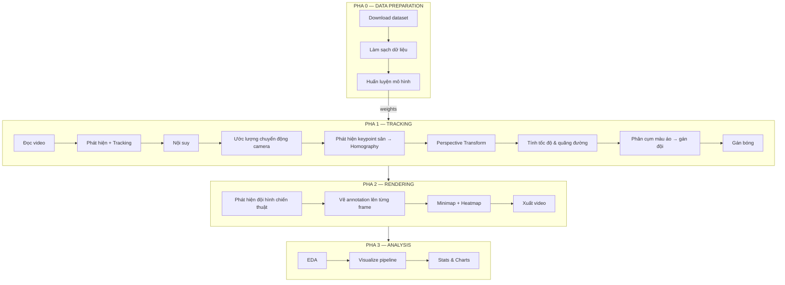

# Pipeline UML

## Flowchart

```mermaid
graph TD
    subgraph P0 ["PHA 0 — DATA PREPARATION"]
        direction LR
        A1[Download dataset] --> A2[Làm sạch dữ liệu] --> A3[Huấn luyện mô hình]
    end

    subgraph P1 ["PHA 1 — TRACKING"]
        direction LR
        B1[Đọc video] --> B2[Phát hiện + Tracking] --> B3[Nội suy] --> B4[Ước lượng chuyển động camera] --> B5[Phát hiện keypoint sân → Homography] --> B6[Perspective Transform] --> B7[Tính tốc độ & quãng đường] --> B8[Phân cụm màu áo → gán đội] --> B9[Gán bóng]
    end 

    subgraph P2 ["PHA 2 — RENDERING"]
        direction LR
        C1[Phát hiện đội hình chiến thuật] --> C2[Vẽ annotation lên từng frame] --> C3[Minimap + Heatmap] --> C4[Xuất video]
    end

    subgraph P3 ["PHA 3 — ANALYSIS"]
        direction LR
        D1[EDA] --> D2[Visualize pipeline] --> D3[Stats & Charts]
    end

    A3 -->|weights| P1
    P1 --> P2
    P2 --> P3
```

