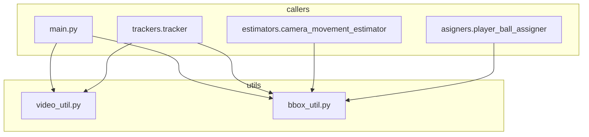

# Đặc tả File utils — Video & Bounding Box Utilities

## 1. Tổng quan

Thư mục `utils/` chứa hai file tiện ích cốt lõi được sử dụng xuyên suốt pipeline:

| File | Chức năng | Số dòng | Số hàm |
|------|-----------|----------|--------|
| `video_util.py` | Đọc và ghi video (với FFmpeg encoding) | 45 | 2 |
| `bbox_util.py` | Tính toán bounding box và khoảng cách | 16 | 5 |

Cả hai file đều là stateless — chỉ chứa hàm thuần túy (pure functions), không class, không biến toàn cục.

---

## 2. File utils/video_util.py

### 2.1. Import (dòng 1–4)

| Dòng | Lệnh | Giải thích |
|------|------|------------|
| 1 | `import cv2` | OpenCV: `VideoCapture` đọc video, `VideoWriter` ghi video, `VideoWriter_fourcc` chọn codec. |
| 2 | `import os` | `os.unlink()` xóa file tạm. |
| 3 | `import subprocess` | Gọi FFmpeg process từ Python để encode H.264 chất lượng cao. |
| 4 | `import tempfile` | Tạo file .avi tạm thời (`NamedTemporaryFile`) trước khi encode sang MP4. |

### 2.2. `read_video(video_path)` (dòng 6–15)

**Mục đích:** Đọc toàn bộ video file thành list các frame (NumPy arrays H×W×3).

| Dòng | Lệnh | Giải thích |
|------|------|------------|
| 7 | `cap = cv2.VideoCapture(video_path)` | Mở video file. OpenCV tự động detect codec qua extension. `VideoCapture` mở file ở chế độ đọc, chưa đọc frame nào. |
| 8 | `frames = []` | Khởi tạo list rỗng để chứa frames. |
| 9–13 | Vòng lặp đọc frame | `cap.read()` trả về tuple `(ret, frame)`. `ret` = True nếu đọc thành công, False nếu hết video hoặc lỗi. `frame` là NumPy array shape `(H, W, 3)` — BGR order (OpenCV default). Mỗi frame được append vào list. |
| 14 | `cap.release()` | Giải phóng bộ nhớ OpenCV (quan trọng: nếu không release, file video bị lock trên Windows). |
| 15 | `return frames` | Trả về list frame. Kích thước bộ nhớ ≈ H × W × 3 × số_frame bytes. Ví dụ: video 640×480, 1000 frame ≈ 900 MB. |

**Ví dụ trả về:**
```python
>>> frames = read_video("sample.mp4")
>>> type(frames)
list
>>> len(frames)
450
>>> frames[0].shape
(720, 1280, 3)
>>> frames[0].dtype
dtype('uint8')
```

**Lưu ý hiệu năng:** `read_video()` load toàn bộ video vào RAM. Với video dài (> 10 phút), dung lượng có thể vượt quá RAM khả dụng. Pipeline hiện tại không hỗ trợ streaming.

### 2.3. `save_video(frames, output_path, fps=24)` (dòng 17–45)

**Mục đích:** Ghi list frame ra file video với codec H.264 (ưu tiên) hoặc MP4V (fallback).

**Ví dụ sử dụng:**
```python
>>> save_video(frames, "output.mp4", fps=30)
# Không trả về (None). File output.mp4 được tạo.
>>> import os; os.path.exists("output.mp4")
True
>>> os.path.getsize("output.mp4")
5_238_471  # ~5 MB cho 15 giây video 720p
```

| Dòng | Lệnh | Giải thích |
|------|------|------------|
| 18–19 | Kiểm tra frames rỗng | Nếu `frames` là list rỗng, thoát ngay. |
| 20 | `h, w = frames[0].shape[:2]` | Lấy kích thước frame từ frame đầu tiên. Tất cả frame phải cùng kích thước. |
| 22–24 | Tạo file .avi tạm | `tempfile.NamedTemporaryFile(suffix='.avi', delete=False)`: tạo file tạm với extension .avi. `delete=False` giữ file sau khi close để FFmpeg có thể đọc. `tmp.name` là đường dẫn đầy đủ (vd: `C:\Users\...\tmpXXXX.avi`). |
| 25 | `fourcc = cv2.VideoWriter_fourcc(*'MJPG')` | Mã codec MJPG (Motion JPEG) — nén nhanh, không loss, nhưng kích thước file lớn. Dùng cho file tạm vì tốc độ ghi cao. `*'MJPG'` unpack string thành 4 ký tự: `('M','J','P','G')`. |
| 26 | `out = cv2.VideoWriter(tmp_path, fourcc, fps, (w, h))` | Khởi tạo VideoWriter ghi file AVI với codec MJPG, FPS chỉ định, kích thước (w, h). |
| 27–29 | Ghi frames | Duyệt từng frame, `out.write(frame)` ghi vào file AVI tạm. `out.release()` đóng file. |
| 30–36 | FFmpeg encode H.264 | `subprocess.run(...)`: gọi FFmpeg với tham số: `-y` (ghi đè), `-i tmp_path` (input), `-c:v libx264` (H.264 codec), `-preset fast` (cân bằng tốc độ/kích thước), `-crf 23` (chất lượng — 0=lossless, 23=mặc định, 51=tệ nhất), `-movflags +faststart` (tối ưu streaming — đặt moov atom ở đầu file), `output_path`. `capture_output=True` (không in FFmpeg log), `check=True` (raise error nếu FFmpeg thất bại). |
| 37–43 | Fallback MP4V | Nếu FFmpeg không có (`FileNotFoundError`) hoặc lỗi (`CalledProcessError`): dùng OpenCV `mp4v` codec để ghi trực tiếp MP4. Chất lượng thấp hơn H.264 nhưng không phụ thuộc FFmpeg. |
| 44–45 | Dọn file tạm | `finally: os.unlink(tmp_path)` — luôn xóa file AVI tạm, dù thành công hay thất bại. |

**Quy trình ghi video 2 bước:**

```
frames → OpenCV MJPG (.avi tạm) → FFmpeg H.264 (.mp4)
                                    ↓ fallback
                              OpenCV mp4v (.mp4)
```

**Giải thích CRF (Constant Rate Factor):**

| CRF | Chất lượng | Kích thước file |
|-----|-----------|----------------|
| 0 | Lossless | Rất lớn |
| 18 | Gần lossless | Lớn |
| 23 | Mặc định (cân bằng) | Trung bình |
| 28 | Chấp nhận được | Nhỏ |
| 51 | Tệ nhất | Rất nhỏ |

---

## 3. File utils/bbox_util.py

### 3.1. `get_center(bbox)` (dòng 1–3)

**Mục đích:** Tính tọa độ tâm của bounding box.

| Dòng | Lệnh | Giải thích |
|------|------|------------|
| 2 | `x1, y1, x2, y2 = bbox` | Unpack list 4 phần tử thành 4 biến. bbox format: `[x_trái, y_trên, x_phải, y_dưới]`. |
| 3 | `return int((x1 + x2) / 2), int((y1 + y2) / 2)` | Tọa độ tâm: trung bình cộng x1+x2 và y1+y2. `int()` ép về số nguyên pixel. |

**Ví dụ trả về:**
```python
>>> get_center([100, 200, 300, 400])
(200, 300)
>>> get_center([0, 0, 50, 100])
(25, 50)
```

**Công thức:** `center = ((x1+x2)/2, (y1+y2)/2)`

**Sử dụng trong pipeline:** Tính vị trí bóng (bóng được đại diện bằng tâm bbox).

### 3.2. `get_bbox_width(bbox)` (dòng 5–6)

**Mục đích:** Tính chiều rộng của bounding box.

| Dòng | Lệnh | Giải thích |
|------|------|------------|
| 6 | `return bbox[2] - bbox[0]` | `x2 - x1` = chiều rộng tính bằng pixel. |

**Ví dụ trả về:**
```python
>>> get_bbox_width([100, 200, 300, 400])
200
>>> get_bbox_width([50, 50, 80, 120])
30
```

**Sử dụng trong pipeline:** `tracker.draw_ellipse()` dùng width để xác định kích thước ellipse dưới chân cầu thủ (`axes=(w, int(0.35*w))`).

### 3.3. `get_foot_position(bbox)` (dòng 8–10)

**Mục đích:** Tính tọa độ chân cầu thủ — điểm tiếp xúc với mặt sân.

| Dòng | Lệnh | Giải thích |
|------|------|------------|
| 9 | `x1, y1, x2, y2 = bbox` | Unpack bbox. |
| 10 | `return int((x1 + x2) / 2), int(y2)` | `x` = trung điểm chiều ngang, `y` = cạnh dưới của bbox. Giả định: chân cầu thủ luôn ở dưới cùng bounding box. |

**Ví dụ trả về:**
```python
>>> get_foot_position([100, 200, 300, 500])
(200, 500)
>>> get_foot_position([400, 300, 500, 600])
(450, 600)
```

**Công thức:** `foot_position = ((x1+x2)/2, y2)`

**So sánh get_center vs get_foot_position:**

| Object | Vị trí | Công thức |
|--------|--------|-----------|
| Ball | Tâm | `((x1+x2)/2, (y1+y2)/2)` |
| Player/Referee | Chân | `((x1+x2)/2, y2)` |

**Sử dụng trong pipeline:**
- `tracker.add_position_to_tracks()` (dòng 145–146 của tracker.py): xác định `position` cho player và referee.
- `PlayerBallAssigner` (trong `asigners/player_ball_assigner.py`): tính khoảng cách từ bóng đến foot position của từng player để xác định ai đang có bóng.
- `tracker.draw_ellipse()`: vẽ ellipse tại foot position.
- `SpeedDistanceEstimator`: dùng `position_adjusted` (đã bao gồm foot position) để tính toán.

### 3.4. `measure_distance(p1, p2)` (dòng 12–13)

**Mục đích:** Tính khoảng cách Euclidean giữa hai điểm.

| Dòng | Lệnh | Giải thích |
|------|------|------------|
| 13 | `return ((p1[0]-p2[0])**2 + (p1[1]-p2[1])**2) ** 0.5` | Công thức Euclidean: `√[(x₁−x₂)² + (y₁−y₂)²]`. `**0.5` thay cho `math.sqrt()`. Trả về float. |

**Ví dụ trả về:**
```python
>>> measure_distance((0, 0), (3, 4))
5.0
>>> measure_distance((100, 200), (150, 220))
53.85164807134504
>>> measure_distance((10, 10), (10, 10))
0.0
```

**Công thức:** `distance = √((x₁−x₂)² + (y₁−y₂)²)`

**Sử dụng trong pipeline:** `PlayerBallAssigner.assign_ball_to_player()` tính khoảng cách từ bóng đến từng player để tìm player gần nhất.

### 3.5. `measure_xy_distance(p1, p2)` (dòng 15–16)

**Mục đích:** Tính khoảng cách theo từng trục (dx, dy) giữa hai điểm.

| Dòng | Lệnh | Giải thích |
|------|------|------------|
| 16 | `return p1[0]-p2[0], p1[1]-p2[1]` | Trả về tuple `(dx, dy)`. Giá trị âm/dương tùy vị trí tương đối. |

**Ví dụ trả về:**
```python
>>> measure_xy_distance((10, 20), (3, 5))
(7, 15)
>>> measure_xy_distance((100, 200), (150, 220))
(-50, -20)
>>> measure_xy_distance((50, 50), (50, 50))
(0, 0)
```

**Sử dụng trong pipeline:** `CameraMovementEstimator` dùng `measure_xy_distance()` (trong `estimators/camera_movement_estimator.py`) để tính độ dịch chuyển camera giữa hai frame liên tiếp.

---

## 4. Bảng tổng hợp

### 4.1. video_util.py

| Hàm | Input | Output | Độ phức tạp |
|-----|-------|--------|-------------|
| `read_video(video_path)` | `video_path: str` | `frames: List[np.ndarray]` | O(n) với n = số frame |
| `save_video(frames, output_path, fps)` | `frames, output_path, fps=24` | None (side effect: file) | O(n) + FFmpeg encode |

### 4.2. bbox_util.py

| Hàm | Input | Output | Ví dụ |
|-----|-------|--------|-------|
| `get_center(bbox)` | `[x1,y1,x2,y2]` | `(cx, cy)` | `get_center([0,0,2,2])` → `(1, 1)` |
| `get_bbox_width(bbox)` | `[x1,y1,x2,y2]` | `w: int` | `get_bbox_width([10,0,50,100])` → `40` |
| `get_foot_position(bbox)` | `[x1,y1,x2,y2]` | `(cx, y2)` | `get_foot_position([0,0,100,200])` → `(50, 200)` |
| `measure_distance(p1, p2)` | `(x1,y1), (x2,y2)` | `d: float` | `measure_distance((0,0), (3,4))` → `5.0` |
| `measure_xy_distance(p1, p2)` | `(x1,y1), (x2,y2)` | `(dx, dy)` | `measure_xy_distance((5,8), (2,3))` → `(3, 5)` |

---

## 5. Sơ đồ phụ thuộc



Cả hai file đều là **leaf modules** — không phụ thuộc vào module nào khác trong project, chỉ phụ thuộc vào thư viện ngoài (OpenCV, Python standard library). Điều này làm cho chúng dễ test, dễ tái sử dụng và không gây circular import.
