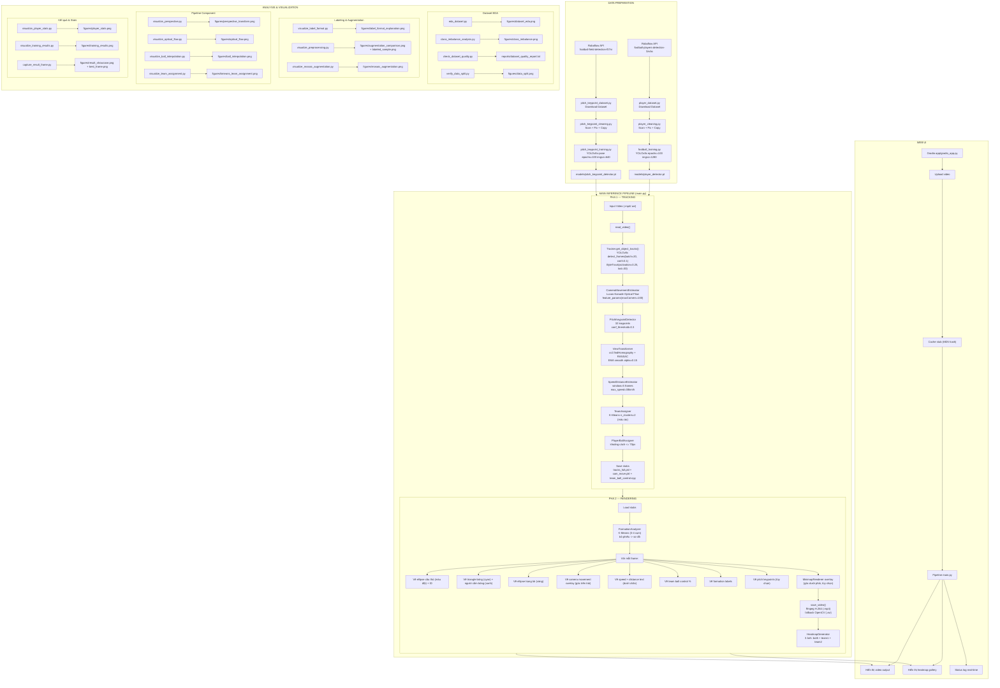
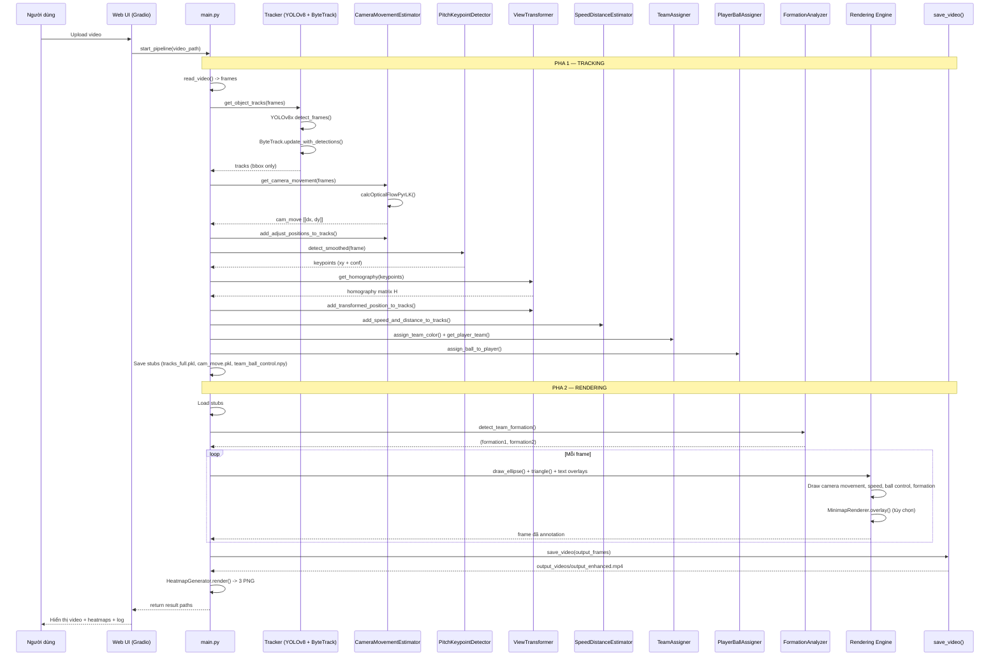
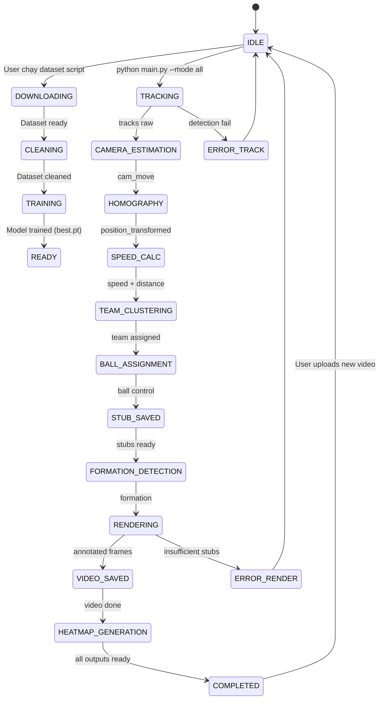
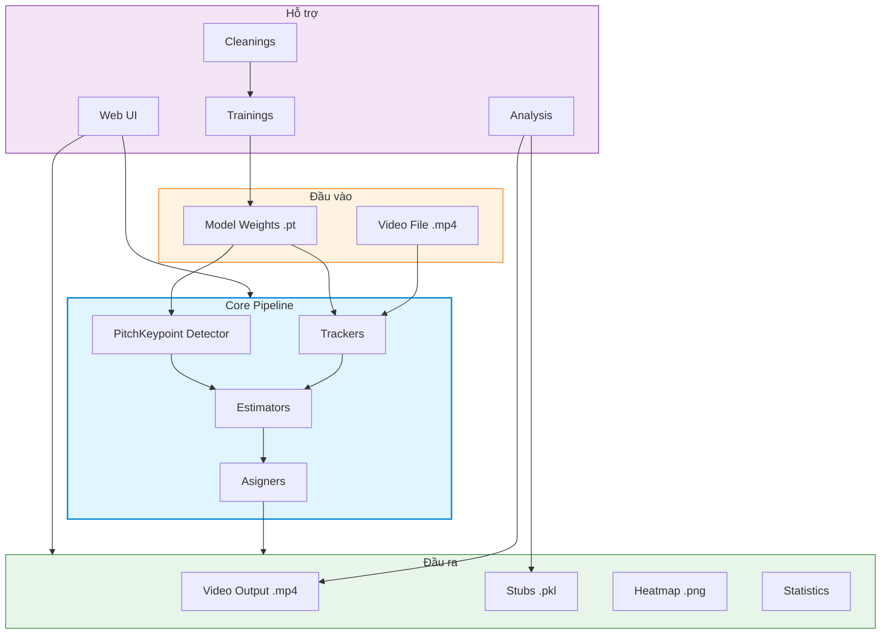

# Sơ Đồ Pipeline Dự Án — Định Dạng UML (Mermaid)

> File này sử dụng cú pháp Mermaid.js để hiển thị sơ đồ UML.
> Xem trên GitHub, GitLab, hoặc dùng `mermaid-cli` để render ra PNG/SVG.

---

## 1. Flowchart Tổng Thể

---

## 2. Sequence Diagram — Luồng Xử Lý Chính

---

## 3. Class Diagram — Quan Hệ Giữa Các Module

```mermaid
classDiagram
    class Tracker {
        +model_path: str
        +tracker: ByteTrack
        +detect_frames(frames, batch_size)
        +get_object_tracks(frames, read_from_stub, stub_path)
        +interpolate_ball_positions(ball_positions)
        +interpolate_player_positions(player_positions)
        +add_position_to_tracks(tracks)
        +draw_ellipse(frame, bbox, color, track_id)
        +draw_triangle(frame, bbox, color)
        +draw_team_ball_control(frame, frame_num, team_ball_control)
        +draw_annotations(video_frames, tracks, team_ball_control)
    }

    class CameraMovementEstimator {
        +first_frame: np.array
        +mask: np.array
        +get_camera_movement(frames, read_from_stub, stub_path)
        +add_adjust_positions_to_tracks(tracks, movement)
        +draw_camera_movement(frames, movement)
    }

    class ViewTransformer {
        +kp_detector: PitchKeypointDetector
        +smooth_alpha: float
        +add_transformed_position_to_tracks(tracks, video_frames)
    }

    class SpeedDistanceEstimator {
        +add_speed_and_distance_to_tracks(tracks, fps)
        +draw_speed_and_distance(frames, tracks)
    }

    class TeamAssigner {
        +team_colors: dict
        +player_team_dict: dict
        +assign_team_color(frame, player_detections)
        +get_player_team(frame, bbox, player_id)
        +get_player_color(frame, bbox)
    }

    class PlayerBallAssigner {
        +max_distance: int
        +assign_ball_to_player(players, ball_bbox)
    }

    class PitchKeypointDetector {
        +model_path: str
        +conf_threshold: float
        +config: SoccerPitchConfig
        +detect(frame)
        +detect_smoothed(frame, alpha)
        +get_homography(frame_keypoints)
        +transform_point(point, M)
    }

    class SoccerPitchConfig {
        +width: int
        +length: int
        +vertices: np.array
        +edges: list
    }

    class MinimapRenderer {
        +render(tracks, frame_num, team_colors)
        +overlay(frame, minimap, pos)
    }

    class HeatmapGenerator {
        +team1_heatmap: np.array
        +team2_heatmap: np.array
        +update_from_tracks(tracks)
        +render_both()
        +render_team(team, colormap)
    }

    class FormationAnalyzer {
        +detect_team_formation(tracks, team_id)
        +detect_formation(positions)
    }

    class GradioApp {
        +video_input: gr.Video
        +chk_keypoints: gr.Checkbox
        +chk_minimap: gr.Checkbox
        +chk_heatmap: gr.Checkbox
        +btn_analyze: gr.Button
        +video_output: gr.Video
        +gallery_heatmap: gr.Gallery
        +status_log: gr.HTML
        +start_pipeline(video_path, show_kp, show_minimap, show_heatmap)
    }

    class PlayerCleaning {
        +scan_split(split)
        +clean_split(split, bad_stems)
        +fix_bbox_labels(split)
        +visualize_before_after(split, n_samples)
    }

    class PitchKeypointCleaning {
        +scan_keypoint_split(split)
        +fix_and_copy_keypoint_split(split, bad_stems)
        +visualize_keypoint_stats(kp_vis_count, kp_per_image, split)
    }

    class FootballTraining {
        +model: YOLO
        +train(data, epochs, imgsz, batch, device)
    }

    class PitchKeypointTraining {
        +model: YOLO
        +train(data, epochs, imgsz, batch, device)
    }

    %% Relationships
    ViewTransformer --> PitchKeypointDetector : uses
    ViewTransformer ..> SoccerPitchConfig : reads config
    MinimapRenderer ..> SoccerPitchConfig : uses dimensions
    GradioApp --> Tracker : calls
    GradioApp --> CameraMovementEstimator : calls
    GradioApp --> ViewTransformer : calls
    GradioApp --> SpeedDistanceEstimator : calls
    GradioApp --> TeamAssigner : calls
    GradioApp --> PlayerBallAssigner : calls
    GradioApp --> FormationAnalyzer : calls
    GradioApp --> MinimapRenderer : calls
    GradioApp --> HeatmapGenerator : calls
    FootballTraining --> PlayerCleaning : uses cleaned dataset
    PitchKeypointTraining --> PitchKeypointCleaning : uses cleaned dataset
```

---

## 4. State Diagram — Trạng Thái Pipeline

---

## 5. Dependency Graph

```mermaid
flowchart LR
    subgraph Deps ["Phụ thuộc giữa các Module"]
        direction LR

        %% Data layer
        RF[Roboflow API] --> DD[Download Dataset]
        DD --> CL[Cleaning Dataset]
        CL --> TR[Training]
        TR --> MW[Model Weights .pt]
        
        %% Pipeline layer
        VI[Video Input] --> RD[read_video OpenCV]
        RD --> DT[YOLOv8 Detection]
        DT --> BT[ByteTrack]
        BT --> CI[Camera Movement<br/>Optical Flow]
        CI --> KP[Pitch Keypoint<br/>YOLOv8-pose]
        KP --> HV[ViewTransformer<br/>Homography]
        HV --> SD[Speed & Distance]
        SD --> TA[Team Assigner<br/>K-Means]
        TA --> BA[Ball Assigner]
        BA --> ST[Save Stubs .pkl]
        
        ST --> LO[Load Stubs]
        LO --> FA[Formation Analyzer<br/>K-Means]
        FA --> DR[Drawing Engine<br/>OpenCV + Matplotlib]
        DR --> MR[MinimapRenderer]
        DR --> HG[HeatmapGenerator]
        DR --> SV[save_video<br/>ffmpeg / OpenCV]
        
        %% Web UI layer
        UI[Gradio App] --> MV[Model Weights .pt]
        UI --> ST
    end

    style RF fill:#f9f,stroke:#333
    style MW fill:#9cf,stroke:#333
    style ST fill:#9cf,stroke:#333
    style SV fill:#6c6,stroke:#333
    style UI fill:#fc6,stroke:#333
```

---

## 6. Component Diagram — Kiến Trúc Module

---

*Tài liệu UML được tạo ngày 07/06/2026, tương ứng commit `139139c`.*
*Render: dùng `mermaid-cli` (`mmdc -i docs/pipeline-uml.md -o docs/pipeline-uml.png`) hoặc xem trực tiếp trên GitHub.*
